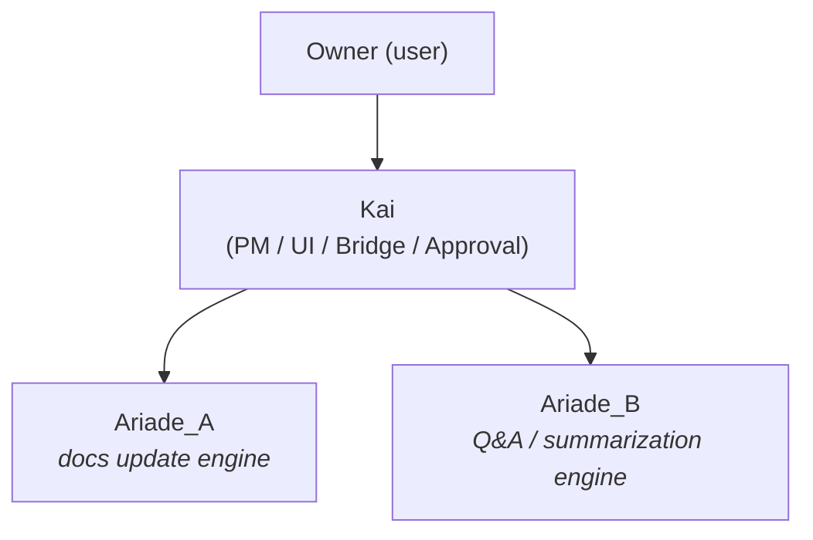

# project_definition.md (PoC 最小構成・Kai 統合)

## 2. 全体目的
AI ベースの仮想 PM (Ariade) を PoC として構築し、  
ドキュメント更新フローと Q&A サポートが実用水準に乗るかを検証。  
**Kai** は唯一の表人格として UI・判断ハブを担い、2025年4月よりプロジェクトマネージャー（PM）として正式に位置付けられた。

## 4. 体制図

## 9. 今後の機能展望
- Kai のプロジェクトマネージャー（PM）機能拡張（進捗管理・タスク割当など）
- Ariade_A/B との連携強化による自動化範囲の拡大
- ユーザー体験向上のためのUI/UX改善
